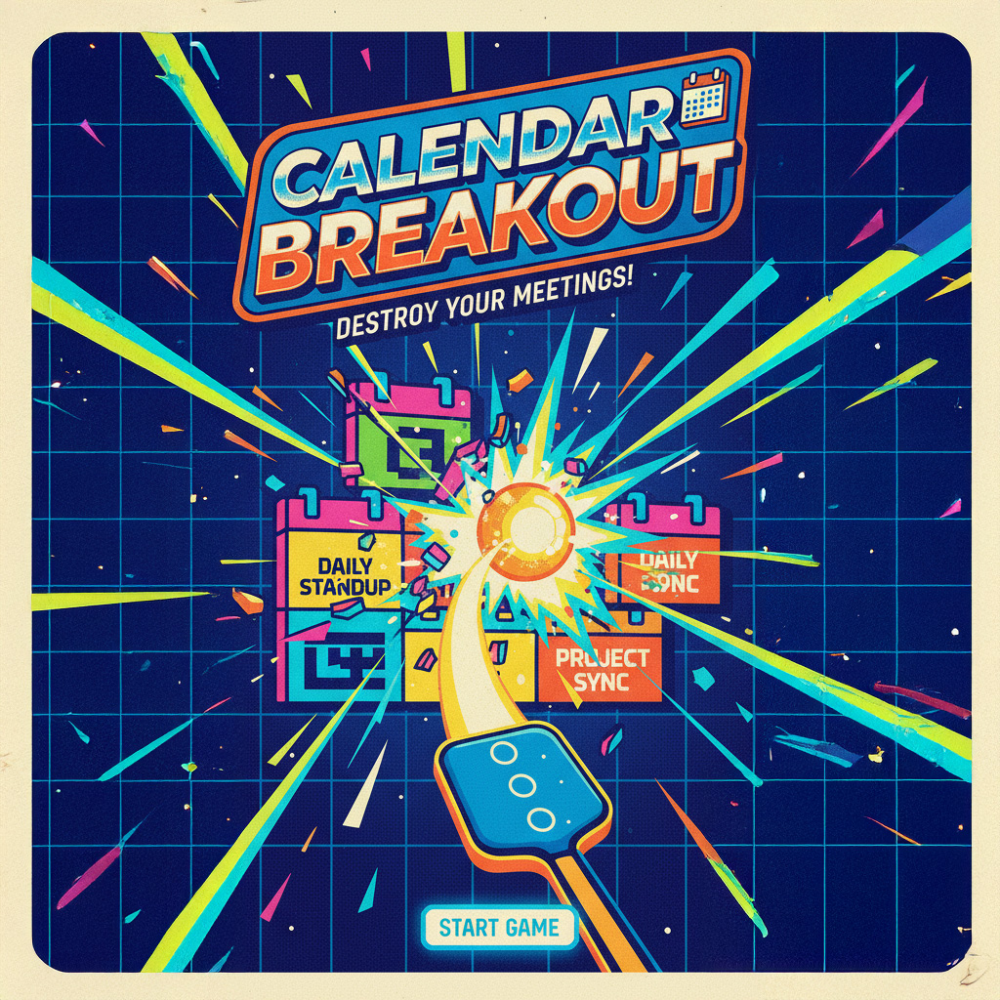

<p align="center">
  
</p>

<p align="center">
  <a href="https://savvyoverthinking.github.io/Bored_Ball/"></a>
</p>

# 📅 Calendar Breakout

<p align="center">
  <strong>An Outlook-styled breakout game to destroy your meetings!</strong>
</p>

<p align="center">
  
  
  
  
</p>

---

## 🎮 Game Overview

Clear your Outlook calendar by destroying all meetings with physics-based gameplay! Navigate through a 52-day work-year of back-to-back meetings, double bookings, and meeting hell. Each meeting type has unique physics effects that modify ball behavior.

### Features

✨ **Outlook-Inspired Design** - Authentic Microsoft calendar aesthetic  
🎯 **52-Day Campaign** - Clear an entire year of meetings  
⚡ **Progressive Difficulty** - Gentle start, brutal endgame (Phase 2)  
🎮 **Daily Power-ups** - 6 different power-ups to help you survive
🏖️ **Weekend Bonus Stages** - Email dodge challenges after every 5th cleared day
⚡ **Physics Effects** - Each meeting type modifies gameplay  
📊 **Multi-Hit Blocks** - Boss meetings require 3 hits to destroy  
🎨 **Theme Support** - Outlook, Google Calendar, or default themes  
📱 **Responsive** - Works on desktop and mobile  

---

## 🚀 Quick Start

### Prerequisites

* **Node.js 20 LTS** (use `.nvmrc` for automatic version)
* npm (not pnpm unless your repo uses it)

```bash
# Check Node version
node -v  # Should be v20.x

# If not, install via nvm
nvm install 20
nvm use 20
```

### Installation

```bash
# Clone the repository
git clone https://github.com/Savvyoverthinking/Bored_Ball.git
cd Bored_Ball

# Install dependencies
npm install

# Start development server (Phase 2 - Enhanced)
npm run dev

# Or start v1.0 (Original)
npm run dev:v1
```

The game will be available at `http://localhost:3000`

### Build for Production

```bash
# Build Phase 2 (Enhanced - Default)
npm run build

# Build v1.0 (Original)
npm run build:v1

# Preview built version
npm run preview
```

---

## 🎮 Controls

| Input | Action |
|-------|--------|
| **Mouse / Touch** | Move paddle |
| **Click / Tap** | Launch ball |
| **Space** | Pause game |
| **R** | Restart level |
| **M** | Toggle mute |

---

## 🎯 Meeting Types & Effects

| Type | Hits | Effect | Color |
|------|------|--------|-------|
| **1:1** 🟣 | 2 | +10% speed | Purple |
| **Team** 🟢 | 2 | Split ball (max 3 total) | Green |
| **Boss** 🔴 | 3 | Speed ×1.8 | Red |
| **Lunch** 🟡 | 1 | Normalize speed | Yellow |
| **Personal** 🟣 | 1 | Reset bounce | Violet |

### Scoring
- **5 points** per hit
- **Bonus points** for destroying harder blocks (Boss = 30 total)
- Score persists across all 52 days

### 🎮 Power-ups (Phase 2)

Daily power-ups spawn 8-16 seconds after the ball launches, so they never expire on the splash screen. Collect by hitting them with the ball.

| Power-up | Effect | Duration |
|----------|--------|----------|
| ☕ **Coffee** | Steady ball speed (prevents chaos) | 15 seconds |
| 🍻 **Happy Hour** | Wide paddle (1.4× size) | 30 seconds |
| 🛡️ **DND** | Free shield (blocks next life loss) | Until used |
| 📅 **Reschedule** | Clears all meetings in current hour | Instant |
| 🧹 **Cleanup** | Converts up to 3 lunch-window meetings into real breaks | Instant |
| 💥 **Multi-Ball** | Spawns 2 extra balls | Instant |

**Note:** Only ONE power-up spawns per day!

---

## 🎨 Themes

Add query parameters to try different calendar styles:

```
http://localhost:3000?theme=outlook   # Microsoft Outlook (default)
http://localhost:3000?theme=google    # Google Calendar
http://localhost:3000?theme=default   # Generic style
```

---

## 🛠️ Development

### Scripts

```bash
npm run dev          # Start dev server (Phase 2 - port 3000)
npm run dev:v1       # Start v1.0 dev server
npm run dev:phase2   # Explicit Phase 2 dev (port 3003)
npm run build        # Build Phase 2 for production
npm run build:v1     # Build v1.0
npm run preview      # Preview production build (port 4173)
npm run typecheck    # TypeScript type checking
npm run lint         # ESLint code linting
npm run format       # Prettier code formatting
```

### Project Structure

```
calendar-breakout/
├── src/
│   ├── components/
│   │   └── CalendarBreakout.tsx    # React wrapper
│   ├── game/
│   │   ├── MainScene.ts            # Core game logic ⭐
│   │   ├── calendarGenerator.ts    # Grid layout engine
│   │   ├── physicsModifiers.ts     # Meeting effects
│   │   ├── constants.ts            # Game balance config
│   │   └── theme.ts                # Theme system
│   ├── data/
│   │   └── mockCalendar.json       # Meeting data (36 meetings)
│   ├── App.tsx
│   ├── main.tsx
│   └── index.css
├── public/
│   └── sprites/                    # Sprite atlas (optional)
│       ├── outlook_sprites.json
│       └── README.md
├── .github/workflows/
│   ├── ci.yml                      # CI pipeline
│   └── deploy-prebuilt.yml         # GitHub Pages deploy
├── dist/                           # Pre-built production files
└── docs/                           # Documentation
```

---

## 🎨 Sprite System (Optional)

The game currently uses code-drawn graphics. For Outlook-authentic sprites:

1. Generate sprite atlas using TexturePacker
2. Place in `public/sprites/outlook_sprites.png`
3. See `public/sprites/README.md` for details

**Atlas Frames:**
- `bg_grid`, `frame_outer`
- `event_15`, `event_30`, `event_45`, `event_60`
- `time_rule`, `day_header`

---

## 🧪 Testing

### Manual Testing Checklist

- [ ] Ball visible and launches on click
- [ ] Paddle follows mouse/touch
- [ ] Blocks require correct number of hits
- [ ] Ball speed clamped (doesn't go infinite)
- [ ] Tuned max balls enforced (2 early, up to 4 late game)
- [ ] Day progression works (1 → 52)
- [ ] Score persists across days
- [ ] Lives system functional
- [ ] Win/lose overlays display
- [ ] Keyboard controls work

---

## 🚀 Deployment

### GitHub Pages (Pre-built Approach)

This project uses **pre-built deployment** to avoid CI build issues.

**Deployment Process:**
1. Build locally: `npm run build`
2. Commit everything (including `dist/` folder): `git add -A && git commit -m "deploy: update"`
3. Push to GitHub: `git push origin main`
4. GitHub Actions deploys the pre-built `dist/` folder
5. Live at: `https://savvyoverthinking.github.io/Bored_Ball/`

**Setup (One Time):**
1. Go to repo **Settings → Pages**
2. Source: **GitHub Actions**
3. Ensure `dist/` is not in `.gitignore` (already configured)

### Vercel (Alternative)

1. Import project at [vercel.com](https://vercel.com)
2. Connect GitHub repository
3. Build command: `npm run build`
4. Output directory: `dist`

---

## 📊 Game Mechanics

### Calendar Layout
- **Days:** Monday - Friday (5 columns)
- **Hours:** 9 AM - 5 PM (8 hours)
- **Meeting Durations:** 15, 30, 45, or 60 minutes
- **Double Bookings:** Overlapping meetings (realistic chaos!)

### Physics System
- **Base Speed:** 260 px/s
- **Min Speed:** 200 px/s (prevents too slow)
- **Max Speed:** 700 px/s (prevents runaway acceleration)
- **Ball Pooling:** Efficient multi-ball management
- **Velocity Clamping:** Applied after every collision

### Progression
- **52 Days** total (full work-year)
- **3 Lives** per game
- Lives carry over between days
- Score accumulates across entire year

---

## 🔮 Roadmap

### ✅ Phase 2 Features (Implemented!)
- [x] Progressive difficulty curve (days 1-52)
- [x] Daily power-ups (6 types)
- [x] Weekend bonus stages (after every 5th cleared day)
- [x] Gentler early game (days 1-5)
- [x] Difficulty scaling (gets brutal by day 52!)

### Phase 3 - Planned Features
- [ ] Sound effects (paddle hit, block destroy)
- [ ] Particle effects on block destruction
- [ ] Additional power-ups (laser, slow motion, etc.)
- [ ] Local high score persistence
- [ ] Mobile touch optimization
- [ ] Achievements system

### Calendar API Integration (Future)
- [ ] Google Calendar OAuth2 PKCE
- [ ] Microsoft Graph API (Outlook)
- [ ] Real-time calendar sync
- [ ] Custom meeting import

---

## 📝 Contributing

Contributions welcome! Please:

1. Fork the repository
2. Create a feature branch (`git checkout -b feature/amazing-feature`)
3. Commit changes (`git commit -m 'Add amazing feature'`)
4. Push to branch (`git push origin feature/amazing-feature`)
5. Open a Pull Request

### Code Style
- Run `npm run format` before committing
- Ensure `npm run typecheck` passes
- Follow existing patterns

---

## 📄 License

MIT License - see [LICENSE](LICENSE) file for details

Copyright (c) 2025 Savvy Overthinking

---

## 🙏 Credits

**Built with:**
- [Phaser 3](https://phaser.io/) - HTML5 game framework
- [React 18](https://react.dev/) - UI library
- [TypeScript](https://www.typescriptlang.org/) - Type safety
- [Vite](https://vitejs.dev/) - Build tool
- [Tailwind CSS](https://tailwindcss.com/) - Styling

**Inspired by:**
- Microsoft Outlook Calendar
- Classic Breakout/Arkanoid
- Meeting overload culture

---

## 💬 Support

- **Issues:** [GitHub Issues](https://github.com/Savvyoverthinking/Bored_Ball/issues)
- **Discussions:** [GitHub Discussions](https://github.com/Savvyoverthinking/Bored_Ball/discussions)

---

<p align="center">
  <strong>Destroy your meetings!</strong> 🎉
</p>

<p align="center">
  Made with ❤️ by <a href="https://github.com/Savvyoverthinking">Savvy Overthinking</a>
</p>
